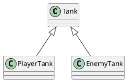

# 深入了解类和对象

# 为什么要将面向对象

1. ts为前端面向对象开发提供了契机

JS语言没有类型检查，如果使用面向对象开发，会产生大量的接口，大量的接口会导致调用复杂度剧增。这种复杂度必须通过严格的类型检查来避免错误。尽管可以使用注释或文档，或记忆力，但是它们没有强约束力。

ts带来了完整的类型系统，因此开发复杂程序时，无论接口数量有多少，都可以获得完整的类型检查，并且这种检查是具有强约束力的

2. 面向对象中有许多非常成熟的模式，能处理复杂问题

在过去很多年中，在大型的应用或者复杂领域，面向对象已经积累多了非常多的经验


## 什么叫面向对象： Oriented(基于) Object(事物), 简称OO

- 是一种编程思想，它提出一切以对象对切入点思考问题
> 学开发最重要的最难的是什么？ 思维

面向过程：以功能流程为思考切入点，不太适合大型应用

函数式编程：以数学运算为思考切入点

面向对象： 以划分类为切入点，类是最小的功能单元

类：可以产生对象的模板


# 如何学习

1. ts中的OOP (面向对象编程， Oriented Object Programing)
2. 小游戏


# 类的继承

## 继承的作用

继承可以描述类与类之间的关系

> 坦克、己方坦克、敌方坦克
> 玩家坦克是坦克， 敌方坦克是坦克

如果A和B都是类，并且可以描述为A是B，则A和B形成继承关系
- B是父类， A是子类
- B派生A, A继承自B
- B是A的基类, 

如果A继承自B， 则A中自动拥有B中的所有成员



继承之后，会拥有父类的所有成员

## 成员的重写
重写（override）:子类中覆盖父类的成员
子类成员不能改变父类成员的类型
无论是属性还是方法，子类都可以对父类的相应成员进行重写，但是重写时，需要保证类型的匹配

注意this关键字：在继承关系中，this的指向是动态的-调用方法时，根据具体的调用者确定this指向

super关键字： 在子类的方法中，可以使用super关键字，读取父类成员


## 类型匹配

鸭子辨型法

子类的对象，始终可以赋值给父类

面向对象中，这种现象叫里氏替换原则

如果需要判断一个数据的具体之类类型，可以使用instanceof
>
>class Tank {
>  name: string = '坦克'
>}
>
>class PlayerTank extands Tank {
>  name: string = '玩家坦克'
>  life: 2
>}
>
>let player: Tank = new PlayerTank()
>// 如果直接使用player.life会报错
>
>//使用类型保护，在里面就可以使用player.lift
>if(player instanceof PlayerTank) {
>  console.log(player.life)
>}
>
>
## protected修饰符(编译结果中没有相关修饰符)

readonly：只读修饰符
访问权限修饰符： private public protected
```protected: 受保护的成员，只能在自身和子类成员中使用```

## 单根性和传递性

单根性：每个类最多只能拥有一个父类

传递性： 如果A是B是的父类，并且B是C的父类， 可以认为A也是C的父类